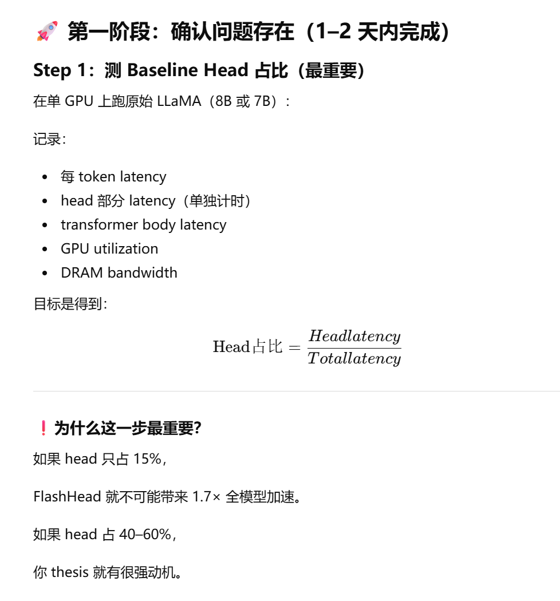

# 2026-02-13
### 1.背景部分：问题是什么，为什么这个问题很重要->影响是什么
1. 为什么我们使用LLaMA架构，有什么说法么
2. 核心瓶颈：Dense classification head 是 LLM 推理阶段最大的计算瓶颈之一，为什么，有什么证据？
- head 占比对模型版本、实现框架、batch size、序列长度、精度、硬件、并行方式高度敏感。你们的 thesis 要做的是“在你们的系统里集成 FlashHead 并评估”，所以至少需要一个轻量级的本地基线测量来把后续所有 speedup/瓶颈讨论锚定住。

1. 我们是否只优化forward 的 softmax 成本？

### 2.动机部分：现有的方案有什么，我们的方法有什么潜力和好处

### 3.Method（方法设计）：算法设计，数据结构，复杂度分析，内存结构
LLM算法说明
FLASH HEAD算法说明

### 4.Experimental Evaluation（实验设计）

| 对比      | 回答的问题                |
| ------- | -------------------- |
| A vs B  | FlashHead 是否有效？      |
| A vs A2 | Dense Head 的扩展性如何？   |
| B vs C  | FlashHead 的扩展性如何？    |
| A2 vs C | FlashHead 是否改善分布式效率？ |

| 版本名称                           | 系统环境           | 模型改动                            | 测试指标                                                                                       | 研究目的                                                   |
| ------------------------------ | -------------- | ------------------------------- | ------------------------------------------------------------------------------------------ | ------------------------------------------------------ |
| **A — Baseline (Single GPU)**  | 单 GPU          | 原始 LLaMA，Dense Softmax Head，无修改 | • Latency / token • TPS (tokens per second) • Head FLOPs 占比 • Task Accuracy       | 作为性能与精度基准，量化 softmax head 在整体推理中的开销                    |
| **B — FlashHead (Single GPU)** | 单 GPU          | 替换 LM head 为 FlashHead，其余不变     | • Latency / token • TPS • Top-k Containment • Task Accuracy • Memory Bandwidth | 评估 FlashHead 单卡加速效果与精度影响，建立 latency–accuracy trade-off |
| **A2 — Baseline (Multi-GPU)**  | 多 GPU（TP / PP） | 原始 Dense Head + 分布式并行           | • Strong Scaling • Weak Scaling • AllReduce 时间 • 通信比例                             | 分析 Dense Head 在分布式环境下的扩展性与通信瓶颈                         |
| **C — FlashHead (Multi-GPU)**  | 多 GPU（TP / PP） | FlashHead + 相同并行策略              | • Strong Scaling • Weak Scaling • Communication Volume • GPU Utilization          | 分析 FlashHead 是否改善 scaling 行为及通信-计算比                    |

在B版本中，即FLASH HEAD添加中，测试不同参数，找出 2–3 个代表性点：比如High-accuracy 点，Balance点，得到B1, B2, B3，再在测试版本C的阶段中，进行拓展测试得到C1, C2, C3；这样可以得到高精度版本是否 scaling 好？高速度版本是否 scaling 更好？
| 变量                     | 测试范围                 | 目的                |
| ---------------------- | -------------------- | ----------------- |
| Cluster 数 K            | 4096 / 8192 / 16384  | 控制候选空间规模          |
| Probe 数 M              | 64 / 128 / 256 / 512 | 控制召回精度            |
| Quantization bit-width | 8-bit / 16-bit       | 分析精度与带宽 trade-off |

用于绘制：
Latency vs Accuracy 曲线
Pareto frontier

| GPU 数         | 1 | 2 | 4 | 8 |
| ------------- | - | - | - | - |
| Baseline (A2) | ✓ | ✓ | ✓ | ✓ |
| FlashHead (C) | ✓ | ✓ | ✓ | ✓ |

### 5.System-level Analysis（系统分析）

- Compute vs Memory Bound 分析：分析Dense head 是computation bound 还是 Memory Bound ->flash head作用在什么地方
- Kernel-level Breakdown 计算拆解
- 多GPU下，从系统来看优化的内容有哪些

### 讨论与局限性